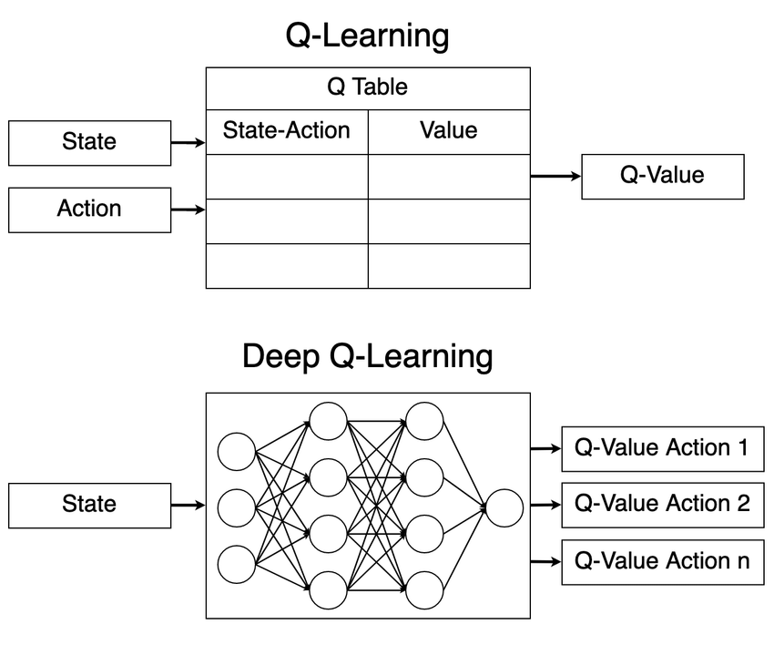

# L13c: Introduction to Deep Q-Learning and Policy Gradient Methods
In this lecture, we will explore the fundamentals of policy gradient methods and actor-critic algorithms in reinforcement learning. These methods are used for training agents to make decisions in complex environments, especially when dealing with continuous state and action spaces.

> __Learning Objectives:__
> 
> By the end of this lecture, you should be able to:
> 
> * __Value-Based Methods__: Q-learning learns a state-action value function through temporal difference updates and derives a policy by selecting actions that maximize Q-values. Deep Q-Networks (DQN) extend this approach by using neural networks to approximate Q-functions, enabling learning in high-dimensional state spaces through experience replay and target networks.
> * __Policy Gradient Methods__: Policy gradient methods directly parameterize the policy and optimize parameters to maximize expected return through gradient ascent. The policy gradient theorem provides the gradient of expected return as an expectation over trajectories, where actions are weighted by returns from that time step onward due to causality.
> * __REINFORCE Algorithm and Variance Reduction__: The REINFORCE algorithm uses Monte Carlo sampling to estimate policy gradients and updates policy parameters through gradient ascent. Subtracting action-independent baselines (such as average episode returns) from returns reduces variance without introducing bias, allowing the algorithm to focus on relative action quality.

Let's get started!
___

## Review: Traditional Q-Learning Problem
Q-learning iteratively estimates the state-action value function $Q(s, a)$ by conducting repeated experiments $t=1,2,\ldots$ in the environment. 
In each experiment, an agent in state $s\in\mathcal{S}$ takes action $a\in\mathcal{A}$, receives a reward $r$, and (potentially) transitions to a new state $s^{\prime}$. After each experiment $t$, the agent updates its estimate of $Q(s, a)$ using the update rule:
$$
\begin{equation*}
Q_{t+1}(s,a)\leftarrow{\underbrace{Q_{t}(s,a)}_{\text{old estimate}}}+\alpha_{t}\cdot\underbrace{\left(r+\gamma\cdot\max_{a^{\prime}\in\mathcal{A}}Q_{t}(s^{\prime},a^{\prime}) - Q_{t}(s,a)\right)}_{\text{TD error}}\quad{t = 1,2,3,\ldots}
\end{equation*}
$$
where $0<\alpha_{t} <{1}$ is the learning rate parameter at time $t$, and $0<\gamma<{1}$ is the discount factor. 
We estimate the policy function $\pi:\mathcal{S}\rightarrow\mathcal{A}$ by selecting the action $a$ that maximizes $Q(s,a)$ at each state $s$:
$$
\begin{equation*}
\pi(s) = \arg\max_{a\in\mathcal{A}}Q(s,a)
\end{equation*}
$$

### Algorithm
Initialize $Q(s,a)$ arbitrarily for all $s\in\mathcal{S}$, and $a\in\mathcal{A}$.
Set the hyperparameters: learning rate $\alpha_{t}$, the discount factor $\gamma$, the exploration rate $\epsilon_{t}$, the maximum number of iterations $\texttt{maxiter}$, and the convergence tolerance $\delta$. Set $\texttt{converged}\gets\texttt{false}$. 

For $s\in\mathcal{S}$
1. Initialize the trial counter $t\gets{1}$
2. While $\texttt{converged} $ is $\texttt{false}$ __do__:
    1. Roll a random number $p\in[0,1]$. Compute $\epsilon_{t}={t^{-1/3}}\cdot\left(K\cdot\log(t)\right)^{1/3}$ where $K=|\mathcal{A}|$ is the number of actions.
    2. If $p\leq\epsilon_{t}$, choose a random (uniform) action $a_{t}\in\mathcal{A}$. Otherwise, choose a greedy action $a_{t} = \text{arg}\max_{a\in\mathcal{A}}{Q_{t}(s,a)}$.
    3. Take action $a_{t}$, observe the reward $r$ from the __environment__ and transition to the next state $s^{\prime}$.
    4. Update the state-action value function: $Q_{t+1}(s_t,a_t)\leftarrow{Q_{t}(s_t,a_t)}+\alpha_{t}\cdot\underbrace{\left(r+\gamma\cdot\overbrace{\max_{a^{\prime}\in\mathcal{A}}Q_{t}(s^{\prime},a^{\prime})}^{\text{one-step lookahead}} - Q_{t}(s_t,a_t)\right)}_{\text{TD error}}$.
    5. Update the state $s\leftarrow{s^{\prime}}$, the learning rate $\alpha_{t+1}\leftarrow\alpha_{t}$, and the counter $t\leftarrow{t+1}$
    6. Convergence check: If $Q(s,a)$ has bounded change $\lVert{Q_{t+1}(s,a) - Q_{t}(s,a)}\rVert\leq\delta$, then the algorithm has converged. Set $\texttt{converged}\gets\texttt{true}$.
    7. Otherwise: if $t\geq\texttt{maxiter}$, then set $\texttt{converged}\gets\texttt{true}$ and notify the caller that the maximum iteration limit was reached without convergence. Proceed to next state.
    8. Otherwise: continue to the next iteration.
3. End While
4. End For

### Convergence
Q-learning converges to the optimal policy under two key theoretical conditions (assuming the Markov property holds for the environment):
* __Learning rate decay__: The learning rate $\alpha_{t}$ must satisfy $\sum_{t=0}^\infty \alpha_t(s, a) = \infty$ and $\sum_{t=0}^\infty \alpha_t^2(s, a) < \infty$ for all state-action pairs, ensuring sufficient initial updates while stabilizing over time. Setting $\alpha_{t+1} \gets \beta\alpha_{t}$ where $\beta<1$ is a common choice.
* __Infinite exploration__: All state-action pairs must be visited infinitely often. This condition holds for $\epsilon$-greedy policies with persistent exploration, i.e., $\epsilon_{t} > 0\,\,\forall{t}$.
___

    

        
    

## Deep Q-Learning Networks (DQN)
In traditional Q-learning, we maintain a table of $Q(s,a)$ values for each state-action pair. However, this approach becomes impractical when dealing with large or continuous state and action spaces. Deep Q-Learning Networks (DQN) address this limitation by using __deep neural networks__ to approximate the Q-function.

> __What is a deep neural network?__ A deep neural network is a type of artificial neural network with multiple layers between the input and output layers. These networks can learn complex patterns in data by adjusting weights through backpropagation during training. We'll take a deep dive into neural networks in later lectures. However, for now, think of them as powerful function approximators (with a huge number of parameters) that can learn to map inputs (states) to outputs (Q-values for actions).

This approach allows for the handling of high-dimensional state spaces, such as images or continuous states, where traditional Q-learning would be infeasible due to the [curse of dimensionality](https://en.wikipedia.org/wiki/Curse_of_dimensionality).
* __Key difference__? In this approach, the Q-value function $Q(s, a)$ is represented as a neural network, which takes the state $s$ as input and outputs the Q-values for all possible actions. The neural network is trained using the same Q-learning update rule, but with mini-batches of experiences sampled from a replay buffer to stabilize training.
* __Games__? This approach was made famous by [the DeepMind team in 2015](https://www.nature.com/articles/nature14236), where they used DQN to play Atari games directly from pixels. This approach achieved human-level performance on other games. For example, DQN was used as part of the policy network [pre-training phase for AlphaGo](https://doi.org/10.1038/nature16961), the first AI to defeat a professional human Go player, marking a milestone in AI. 
* __Other applications__? DQN has been used in other applications such as operations management, e.g., a [DQN-based system was deployed in Google’s data centers to optimize cooling, achieving a reported 30% reduction in energy consumption for cooling systems](https://deepmind.google/discover/blog/deepmind-ai-reduces-google-data-centre-cooling-bill-by-40/) or [traffic signal control in smart cities](https://dl.acm.org/doi/10.1145/3219819.3220096), where DQN was used to optimize traffic light timings in real-time, leading to reduced congestion and improved traffic flow.

### DQN Theory
A deep Q-learning agent learns a policy $\pi$ that maximizes the expected cumulative reward $r_t$ over time. Suppose the agent is tasked with making decisions over $T\rightarrow\infty$ steps.

For each episode, we sample for $t = 1,2,\ldots,T$: 

1. __Interaction with the environment__: At each time step $t$, the agent observes the current state $s_t$, selects an action $a_t$ (typically using an $\epsilon$-greedy policy based on the _Q-network_), and receives a reward $r_t$ and the next state $s_{t+1}$ from the environment.
2. __Experience replay__: Each transition tuple $(s_t, a_t, r_t, s_{t+1})$ is stored in a **replay buffer** (a finite-sized memory that we'll use for training). Instead of training on consecutive samples, the agent **samples random mini-batches** from this buffer. 
3. __Main Q-Network (Function Approximator)__: The core of DQN is a deep neural network $Q_{\theta}(s)$ with (trainable) parameters $\theta$, which learns to approximate the optimal action-value function. The network takes a state as input and outputs Q-values for all possible actions.
4. __Target Q-Network__: To stabilize training, DQN uses a **target network** $Q^{\prime}_{\theta^{-}}(s)$, which is a delayed copy of the main Q-network. The target network’s parameters $\theta^-$ are updated periodically (e.g., every $N$ steps) by copying the weights from the main Q-network.

#### Batch DQN Algorithm

__Initialize__ the parameters of the main Q-network $Q_{\theta}(s)$ and the target Q-network $Q^{\prime}_{\theta^{-}}(s)$ to random values. Initialize a (potentially infinite) replay buffer $\mathcal{B}$. Set the hyperparameters: the learning rate $\alpha$, the discount factor $\gamma$, the exploration rate $\epsilon_{t}$, the minimum number of experiences in the replay buffer $B$, and the parameter update count $\mathcal{C}$.
- For each episode, initialize the state to $s_0$ and:
   - For each time step $t=1,\ldots,T$:
        1. Roll a random number $p\in[0,1]$. If $p\leq\epsilon_{t}$, choose a random (uniform) action $a_{t}\in\mathcal{A}$. Otherwise, choose a greedy action $a_{t} = \text{arg}\max_{a\in\mathcal{A}}{Q_{\theta}(s_{t})}$.
        2. Execute action $a_{t}$, observe the reward $r_{t}$ from the _environment_ and transition to the next state $s_{t+1}$. 
        3. Store the transition (experience) $\mathcal{e}=(s_t, a_t, r_t, s_{t+1})$ in the replay buffer: $\mathcal{e}\rightarrow\mathcal{B}$. 
        5. If the replay buffer $\mathcal{B}$ has a _minimum number of elements_: sample a mini-batch of experiences $(s_i, a_i, r_i, s_{i+1})$ from the replay buffer.  The agent randomly samples a mini-batch of $B$ transitions from the replay buffer:  $(s_j, a_j, r_j, s_{j+1}),\, j = 1, 2, \dots, B$. Each tuple represents a state-action-reward-next state experience example collected during environment interaction.
        6. Compute the _target Q-value_ for each transition in the mini-batch using the _target Q-network_: $y_i = r_i + \gamma \cdot \max_{a^{\prime}\in\mathcal{A}}Q^{\prime}_{\theta^{-}}(s_{i+1})$ for $i=1,2,\ldots,B$.
        7. Compute the _mean squared loss_ function over the $B$ experiences collected in the mini-batch: $L(\theta) = \frac{1}{B}\sum_{i=1}^{B}\left(y_i - Q_{\theta}(s_i, a_i)\right)^2$.
        8. Perform a _single_ gradient descent step to minimize the loss function $L(\theta)$ with respect to the parameters $\theta$ of the main Q-network $Q_{\theta}(s)$: $\theta \leftarrow \theta - \alpha \nabla_{\theta}L(\theta)$, where $\alpha$ is the learning rate. 
            > - _Why only a single step_? Each mini-batch is just a _small sample of the environment’s dynamics._ The goal of DQN is _online learning_: the network parameters are continuously updated as new experiences come in. If we force training to converge on each mini-batch, it risks _overfitting to that mini-batch_.
        10. Update the state $s_t \leftarrow s_{t+1}$.
        9. Every $C$ steps, update the target Q-network parameters: $\theta^{-} \leftarrow \theta$.
    - End For
- End For

Value-based methods like Q-learning and DQN work well for problems with discrete action spaces. However, what if we have continuous action spaces (e.g., steering angles, motor torques) or want to learn stochastic policies directly? 

This motivates **policy gradient methods**, which take a fundamentally different approach by directly optimizing the policy parameters instead of learning Q-values.
___

## Policy Gradient Methods
So far we have looked at **value-based** methods, such as Q-learning and Deep Q-learning, which learn a value function $Q(s,a)$ and derive a policy from it.
In both cases, the **policy** is derived *from* the learned value function by taking an $\arg\max_a Q(s,a)$ step (possibly with exploration noise).

> __Policy gradient methods__
> 
> Policy gradient methods flip this around. Instead of learning the state-action value function $Q(s,a)$ and then extracting a policy, we directly **parameterize the policy** and choose the parameters that maximize expected return.

This gives us a clean way to handle **stochastic** policies, **continuous** action spaces, and large-scale problems where $\max_a Q(s,a)$ is awkward, expensive, or impossible to compute. Let's look at how this works with a simple example policy for continuous state spaces and discrete action spaces.

### Parameterized policies
Suppose we assume that the agent uses a stochastic policy of the form:
$$
\begin{align*}
\pi_\theta(a\mid s) & = \mathbb{P}(a_t = a \mid s_t = s; \theta),
\end{align*}
$$
where $\theta$ is a vector of parameters (e.g., the weights of a neural network), and this represents the probability of selecting action $a$ in state $s$ under policy parameterized by $\theta$. For a discrete action space, but a continuous state space, a common choice is a __softmax policy__:
$$
\pi_\theta(a\mid s) =
\frac{\exp\big(\theta_a^\top \phi(s)\big)}
{\sum_{a'} \exp\big(\theta_{a'}^\top \phi(s)\big)},
$$
where $\phi(s)$ is a feature vector of the state, and each action $a$ has its own parameter vector $\theta_a$. 

> __What is $\phi(s)$?__ The feature vector $\phi(s)$ is a representation of the state $s$ in a higher-dimensional space. It can include raw state variables, polynomial features, or other transformations that help the policy capture relevant patterns in the state space:
>$$
\begin{align*}
\phi : \mathcal{S} \to \mathbb{R}^d, \qquad \phi(s) =
\begin{bmatrix}
\phi_1(s) \\ \vdots \\ \phi_d(s)
\end{bmatrix}.
\end{align*}
$$
> The score for action $a$ in state $s$ is $z_a = \theta_a^\top \phi(s)$, and the softmax turns these scores into probabilities.

Our objective is to choose $\theta$ to maximize the expected discounted return under this policy:
$$
J(\theta) = \mathbb{E}_{\pi_\theta}\big[ G_0 \big],
$$
where the discounted return at time $t$ is defined as
$$
\begin{align*}
G_t &= \sum_{k=t}^{T-1} \gamma^{k-t} r_{k+1}
\end{align*}
$$
where $\gamma\in[0,1)$ is the discount factor. So the learning problem becomes a continuous optimization problem:
$$
\max_{\theta} J(\theta).
$$
One way to solve this is to use (stochastic) __gradient ascent__. We want to compute the gradient $\nabla_\theta J(\theta)$ so we can use (stochastic) gradient ascent. If we write a whole trajectory of $T$-steps per episode as:
$$
\begin{align*}
\tau &= (s_0,a_0,r_1,s_1,a_1,r_2,\dots,s_{T-1},a_{T-1},r_T),
\end{align*}
$$
then the __expected value__ of the objective function $J(\theta)$ over many episodes can be written as:
$$
\begin{align*}
J(\theta) &= \sum_{\tau} p_\theta(\tau)\;G(\tau)\\
& = \mathbb{E}_{\pi_\theta}\big[ G(\tau) \big].
\end{align*}
$$
where $p_\theta(\tau)$ is the probability of observing trajectory $\tau$ under policy $\pi_\theta$, and $G(\tau)$ is the return for the trajectory $\tau$. Using the log–derivative trick (identity):
$$
\begin{align*}
\nabla_\theta p_\theta(\tau) &= p_\theta(\tau)\;\nabla_\theta \log p_\theta(\tau),
\end{align*}
$$
and the fact that only the policy depends on the parameters $\theta$, one can show that
$$
\begin{align*}
\nabla_\theta J(\theta) & = \sum_{\tau} \underbrace{\nabla_\theta p_\theta(\tau)}_{\text{L.D.T}}\;G(\tau) \\
& = \sum_{\tau} p_\theta(\tau)\;\nabla_\theta \log p_\theta(\tau)\;G(\tau) \\
& = \mathbb{E}_{\pi_\theta}\left[
\nabla_\theta \log p_\theta(\tau)\;G(\tau)
\right].
\end{align*}
$$
However, the probability of a trajectory $\tau$ can be written as:
$$
\begin{align*}
p_\theta(\tau) & = p(s_0)\prod_{t=0}^{T-1} \pi_\theta(a_t\mid s_t)\;p(s_{t+1}\mid s_t,a_t),
\end{align*}
$$
where $p(s_0)$ is the distribution of initial states, and $p(s_{t+1}\mid s_t,a_t)$ is the environment's transition probability. Since the environment dynamics do not depend on the policy parameters $\theta$, we have:
$$
\begin{align*}
\nabla_\theta \log p_\theta(\tau) & = \nabla_\theta \log \left(
p(s_0)\prod_{t=0}^{T-1} \pi_\theta(a_t\mid s_t)\;p(s_{t+1}\mid s_t,a_t)
\right) \\
& = \nabla_\theta \left(\underbrace{\log p(s_0)}_{\text{no }\theta} + \sum_{t=0}^{T-1} \log \pi_\theta(a_t\mid s_t) + \underbrace{\sum_{t=0}^{T-1} \log p(s_{t+1}\mid s_t,a_t)}_{\text{no }\theta}\right) \\
& = \sum_{t=0}^{T-1} \nabla_\theta \log \pi_\theta(a_t\mid s_t).
\end{align*}
$$
Now, applying this to the gradient of $J(\theta)$:
$$
\begin{align*}
\nabla_\theta J(\theta) & = \mathbb{E}_{\pi_\theta}\left[
\nabla_\theta \log p_\theta(\tau)\;G(\tau)
\right] \\
& = \mathbb{E}_{\pi_\theta}\left[
\left(\sum_{t=0}^{T-1} \nabla_\theta \log \pi_\theta(a_t\mid s_t)\right)\;G(\tau)
\right] \\
\end{align*}
$$

Now we apply the **causality principle** to simplify this expression. Note that $G(\tau) = G_0 = \sum_{k=0}^{T-1} \gamma^{k} r_{k+1}$ is the __total discounted return__ for the entire trajectory. However, the action $a_t$ taken at time $t$ can only influence rewards from time $t$ onward—it cannot affect rewards that were already received at times $0, 1, \ldots, t-1$.

More formally, we can expand the sum and observe that:
$$
\begin{align*}
\nabla_\theta J(\theta) & = \mathbb{E}_{\pi_\theta}\left[
\sum_{t=0}^{T-1} \nabla_\theta \log \pi_\theta(a_t\mid s_t)\;G(\tau)
\right] \\
& = \mathbb{E}_{\pi_\theta}\left[
\nabla_\theta \log \pi_\theta(a_0\mid s_0)\;G_0 + \nabla_\theta \log \pi_\theta(a_1\mid s_1)\;G_0 + \cdots + \nabla_\theta \log \pi_\theta(a_{T-1}\mid s_{T-1})\;G_0
\right].
\end{align*}
$$

For each term, we can replace $G_0$ (total return) with $G_t$ (return from time $t$ onwards) because rewards from times $0$ to $t-1$ are independent of the action at time $t$. Mathematically, when we condition on the action $a_t$, the expectation over rewards $r_1, r_2, \ldots, r_t$ (which depend on actions $a_0, \ldots, a_{t-1}$) factors out and contributes zero to the gradient:
$$
\boxed{
\begin{align*}
\nabla_\theta J(\theta) & = \mathbb{E}_{\pi_\theta}\left[
\sum_{t=0}^{T-1} \nabla_\theta \log \pi_\theta(a_t\mid s_t)\;G_t
\right]\quad\blacksquare\\
\end{align*}}
$$
where $G_t = \sum_{k=t}^{T-1} \gamma^{k-t} r_{k+1}$ is the return from time $t$ onwards. This replacement **reduces variance** (fewer terms in $G_t$ than in $G_0$ for large $t$) without introducing bias. This result is often called the **policy gradient theorem** (episodic form).

> __The key takeaway__:
>
> The gradient of the expected return can be written as an expectation of $\nabla_\theta \log \pi_\theta(a_t\mid s_t)$ multiplied by a return term. This expectation can be approximated by Monte Carlo sampling from the current policy $\pi_\theta$. Let's look at a simple algorithm based on this idea, namely the **REINFORCE** algorithm.

___

### REINFORCE: a Monte Carlo policy gradient algorithm
The simplest policy–gradient algorithm is called **REINFORCE**. This algorithm uses Monte Carlo sampling to estimate the policy gradient and updates the policy parameters using this information. Let's outline the __REINFORCE__ algorithm.

__Initialize:__ a policy $\pi_\theta$ with policy parameters $\theta$ (e.g., small random values and the softmax policy). Specify a learning rate $\alpha > 0$, a discount factor $\gamma \in [0,1)$, the number of steps per episode $T$, and the maximum number of episodes $\texttt{maxepisodes}$.

> __Hyperparameter selection__:
>
> * **Learning rate $\alpha$**: Policy gradient methods typically use values between $10^{-3}$ and $10^{-1}$. Start with $\alpha = 10^{-3}$ or $10^{-2}$ for most problems. Higher values (e.g., $5 \times 10^{-2}$) can work for simple tasks but may cause instability. Lower values (e.g., $10^{-4}$) are appropriate when using function approximation with many parameters. Consider using a decreasing schedule (e.g., $\alpha_t = \alpha_0 / (1 + t/\tau)$) if convergence is slow or unstable.
> * **Episode length $T$**: Set $T$ based on the task horizon. For episodic tasks with natural termination, let episodes run until the terminal state is reached. For continuing tasks without termination, set $T$ between $100$ and $1000$ steps depending on the problem. Longer horizons capture more long-term dependencies but increase variance in gradient estimates.
> * **Number of episodes $\texttt{maxepisodes}$**: Policy gradient methods often require tens of thousands to millions of episodes. Start with at least $10000$ episodes for simple problems. Complex environments may need $10^5$ to $10^6$ episodes. Monitor average return over windows of $100$ episodes to assess convergence. Training time depends on environment complexity and policy parameterization.
> * **Discount factor $\gamma$**: Standard values are $\gamma \in [0.9, 0.99]$ or $\gamma \in [0.95, 0.999]$ for tasks requiring long-term planning. Use $\gamma = 0.99$ as a default starting point. Values closer to $1$ (e.g., $0.999$) are appropriate for tasks where distant future rewards matter equally to immediate rewards. Lower values (e.g., $0.9$) work for tasks where immediate rewards dominate.

For episode $1$ to $\texttt{maxepisodes}$ __do__:
  1. Generate the data for the episode by following $\pi_\theta$: $s_0,a_0,r_1,s_1,\dots,s_{T-1},a_{T-1},r_T$.
  2. For each time step $t\in{0,1,\ldots,T-1}$ __do__:
     * Compute the return from time $t$: $G_t = \sum_{k=t}^{T-1} \gamma^{k-t} r_{k+1}.$
     * Update the policy parameters using a gradient ascent update rule: $\theta \leftarrow \theta + \alpha\;\nabla_\theta \log \pi_\theta(a_t\mid s_t)\;G_t$ where $\alpha > 0$ is the learning rate.

__Intuition__:

* The $\nabla_\theta \log \pi_\theta(a_t\mid s_t)$ term tells us how to nudge the parameters to **increase** the probability of taking action $a_t$ in state $s_t$.
* Multiplying by return $G_t$ means we reinforce actions that lead to high return and discourage those that lead to low return.

> The __REINFORCE__ algorithm is:
> * **On–policy**: episodes are generated by the current policy $\pi_\theta$. We need to have a policy to generate data.
> * **Monte Carlo**: it uses complete returns, so it requires full episodes.
> * **Unbiased**: the gradient estimate is correct in expectation, but it can have **high variance**.
>
> How might we reduce the variance of the gradient estimate?

To reduce variance, we often subtract a **baseline** $b(s_t)$ from the return.

### Reducing variance with baselines
The REINFORCE algorithm can suffer from high variance because returns $G_t$ can vary significantly across episodes. To reduce variance, we subtract a **baseline** $b$ from the return:
$$
\theta \leftarrow \theta + \alpha\;\nabla_\theta \log \pi_\theta(a_t\mid s_t)\;\big( G_t - b \big).
$$

The key insight is that if the baseline $b$ does **not** depend on the action $a_t$, subtracting it does not change the expected gradient (remains unbiased), but it can significantly reduce variance.

#### Practical baseline choices

The simplest and most practical baseline is the **average return across episodes**:
$$
b = \bar{G} = \frac{1}{N}\sum_{i=1}^{N} G_0^{(i)},
$$
where $N$ is the number of episodes collected so far, and $G_0^{(i)} = \sum_{k=0}^{T-1} \gamma^k r_{k+1}^{(i)}$ is the total discounted return from episode $i$. This baseline is easy to compute and maintain (just keep a running average), requires no additional learning or function approximation, and centers the returns around zero, which helps stabilize learning. 

Another common choice is the **exponential moving average** over episodes:
$$
b_{n+1} = \beta \cdot b_n + (1-\beta) \cdot G_0^{(n)},
$$
where $n$ indexes the episode number, $G_0^{(n)}$ is the total return from episode $n$, and $\beta \in [0.9, 0.99]$ controls how quickly the baseline adapts. This gives more weight to recent episodes and adapts to non-stationary environments where the policy is improving over time.

> __Interpretation:__
> 
> Subtracting a baseline shifts the returns to be centered around zero. Actions that achieve returns above the baseline ($G_t - b > 0$) are reinforced, while actions that achieve returns below the baseline ($G_t - b < 0$) are discouraged. This relative comparison reduces variance without biasing the gradient.

> __Advanced baselines:__
> 
> More sophisticated methods learn a state-dependent baseline $b(s_t) \approx U^{\pi_\theta}(s_t)$, where $U^{\pi_\theta}(s_t)$ is the expected return from state $s_t$. This requires training a separate function approximator (such as a neural network) and leads to **actor-critic** methods, which we will explore in future courses.

___

## Summary

In this lecture, we explored value-based and policy-based methods for reinforcement learning, with focus on Deep Q-Networks and policy gradient approaches:

> __Key Takeaways:__
>
> 1. **Value-based methods learn action-value functions**: Q-learning and DQN learn Q(s,a) functions that estimate expected returns for state-action pairs, deriving policies by selecting actions that maximize Q-values. DQN uses neural networks with experience replay and target networks to handle high-dimensional state spaces where tabular methods fail.
> 2. **Policy gradient methods directly optimize parameterized policies**: Policy gradient methods parameterize policies with parameters θ and use gradient ascent to maximize expected return. The policy gradient theorem shows that the gradient can be computed using trajectories sampled from the current policy, with actions weighted by returns from that time onward based on the causality principle.
> 3. **Baselines reduce variance in policy gradient estimates**: The REINFORCE algorithm implements policy gradients through Monte Carlo sampling but suffers from high variance. Subtracting action-independent baselines such as average episode returns or exponential moving averages reduces variance without introducing bias by centering returns around zero for relative action comparison.

These methods provide complementary approaches for training agents in reinforcement learning tasks, with value-based methods suited for discrete action spaces and policy gradient methods handling continuous actions and stochastic policies.

___
